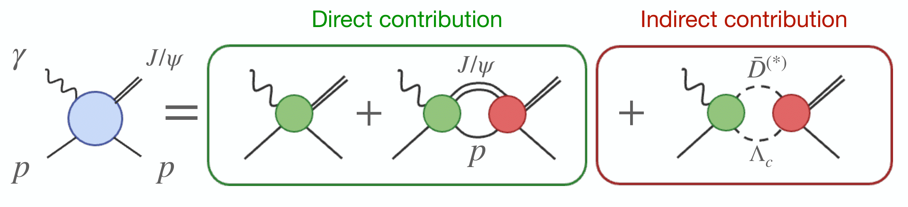

# Dynamics in near-threshold $J/\psi$ photoproduction

  

Code and resources to reproduce results of the $K$-matrix analysis of Jefferson Lab data of the near-threshold $J/\psi$ photoproduction in [arxiv:2305.01449](https://arxiv.org/abs/2305.01449). Provided are two sets of codes in Python and in C++. There is substantial overlap between these codes as cross checks and the combination of the two will reproduce all steps of the analysis. 

Usage and installation instructions are found in each directories' README.

  

